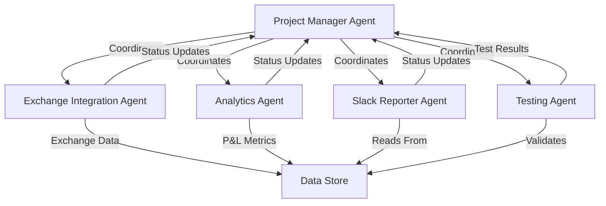

# Product Requirements Document - Multi-Agent Architecture
## CEX Multi-Exchange Reporting Dashboard with Slack Integration

**Project:** Alkimi CEX Portfolio Reporter  
**Timeline:** 4-8 hours (2-3 hours with parallel agents)  
**Architecture:** Multi-Agent Claude Code System  
**Version:** 2.0 Agent-Based MVP  

---

## 1. Agent Architecture Overview

### 1.1 Agent Orchestration Model



### 1.2 Agent Definitions

| Agent ID | Role | Primary Tasks | Output |
|----------|------|---------------|--------|
| PM-001 | Project Manager | Task decomposition, dependency management, integration | Task queue, status dashboard |
| EX-001 | Exchange Specialist | MEXC & Kraken integration | Exchange clients, data models |
| EX-002 | Exchange Specialist | KuCoin & Gate.io integration | Exchange clients, data models |
| AN-001 | Analytics Engine | P&L calculations, portfolio aggregation | Analytics module |
| SL-001 | Slack Integration | Message formatting, webhook setup | Slack reporter |
| TS-001 | Testing & QA | Integration testing, data validation | Test suite, validation |

---

## 2. Agent Task Specifications

### 2.1 Project Manager Agent (PM-001)

**Initialize with this prompt:**
```markdown
You are the Project Manager Agent for the CEX Reporter project. Your responsibilities:
1. Break down the PRD into atomic tasks
2. Assign tasks to specialist agents
3. Monitor progress via shared task_status.json
4. Resolve blocking issues
5. Coordinate integration points

Create a task_queue.json with all tasks and dependencies.
Monitor agent outputs in the shared /workspace directory.
```

**Task Queue Structure:**
```json
{
  "tasks": [
    {
      "id": "T001",
      "agent": "EX-001",
      "description": "Create MEXC exchange client",
      "dependencies": [],
      "status": "pending",
      "output_path": "/workspace/exchanges/mexc_client.py",
      "estimated_time": "30 minutes",
      "priority": "P0"
    },
    {
      "id": "T002",
      "agent": "EX-001",
      "description": "Create Kraken exchange client",
      "dependencies": [],
      "status": "pending",
      "output_path": "/workspace/exchanges/kraken_client.py",
      "estimated_time": "30 minutes",
      "priority": "P0"
    },
    {
      "id": "T003",
      "agent": "EX-002",
      "description": "Create KuCoin exchange client",
      "dependencies": [],
      "status": "pending",
      "output_path": "/workspace/exchanges/kucoin_client.py",
      "estimated_time": "30 minutes",
      "priority": "P0"
    },
    {
      "id": "T004",
      "agent": "EX-002",
      "description": "Create Gate.io exchange client",
      "dependencies": [],
      "status": "pending",
      "output_path": "/workspace/exchanges/gateio_client.py",
      "estimated_time": "30 minutes",
      "priority": "P0"
    },
    {
      "id": "T005",
      "agent": "AN-001",
      "description": "Create portfolio aggregator",
      "dependencies": ["T001", "T002", "T003", "T004"],
      "status": "blocked",
      "output_path": "/workspace/analytics/portfolio.py",
      "estimated_time": "45 minutes",
      "priority": "P0"
    },
    {
      "id": "T006",
      "agent": "AN-001",
      "description": "Create P&L calculator",
      "dependencies": ["T005"],
      "status": "blocked",
      "output_path": "/workspace/analytics/pnl_calculator.py",
      "estimated_time": "30 minutes",
      "priority": "P0"
    },
    {
      "id": "T007",
      "agent": "SL-001",
      "description": "Create Slack message formatter",
      "dependencies": [],
      "status": "pending",
      "output_path": "/workspace/reporting/slack_formatter.py",
      "estimated_time": "30 minutes",
      "priority": "P0"
    },
    {
      "id": "T008",
      "agent": "SL-001",
      "description": "Create Slack webhook client",
      "dependencies": ["T007"],
      "status": "blocked",
      "output_path": "/workspace/reporting/slack_client.py",
      "estimated_time": "20 minutes",
      "priority": "P0"
    },
    {
      "id": "T009",
      "agent": "TS-001",
      "description": "Create integration tests",
      "dependencies": ["T005", "T008"],
      "status": "blocked",
      "output_path": "/workspace/tests/integration_tests.py",
      "estimated_time": "45 minutes",
      "priority": "P1"
    },
    {
      "id": "T010",
      "agent": "PM-001",
      "description": "Create main orchestrator",
      "dependencies": ["T006", "T008"],
      "status": "blocked",
      "output_path": "/workspace/main.py",
      "estimated_time": "30 minutes",
      "priority": "P0"
    }
  ]
}
```

---

### 2.2 Exchange Integration Agents (EX-001, EX-002)

**Shared Interface Contract:**
```python
# All exchange clients must implement this interface
class ExchangeInterface:
    async def get_balances(self) -> Dict[str, float]:
        """Returns: {"SYMBOL": amount, ...}"""
        pass
    
    async def get_trades(self, since: datetime) -> List[Trade]:
        """Returns list of Trade objects"""
        pass
    
    async def get_prices(self, symbols: List[str]) -> Dict[str, float]:
        """Returns: {"SYMBOL": usd_price, ...}"""
        pass
```

**Agent EX-001 Prompt:**
```markdown
You are Exchange Integration Agent EX-001. Your tasks:
1. Create MEXC exchange client implementing ExchangeInterface
2. Create Kraken exchange client implementing ExchangeInterface
3. Use ccxt library for standardization
4. Include rate limiting and error handling
5. Write to /workspace/exchanges/

Requirements:
- Read-only API operations only
- Implement exponential backoff
- Cache responses for 60 seconds
- Log all API calls to /workspace/logs/
```

**Agent EX-002 Prompt:**
```markdown
You are Exchange Integration Agent EX-002. Your tasks:
1. Create KuCoin exchange client implementing ExchangeInterface
2. Create Gate.io exchange client implementing ExchangeInterface
3. Use ccxt library for standardization
4. Include rate limiting and error handling
5. Write to /workspace/exchanges/

Requirements:
- Read-only API operations only
- Implement exponential backoff
- Cache responses for 60 seconds
- Log all API calls to /workspace/logs/
```

---

### 2.3 Analytics Agent (AN-001)

**Agent Prompt:**
```markdown
You are Analytics Agent AN-001. Your tasks:
1. Create portfolio aggregator that combines data from all exchanges
2. Implement P&L calculator with multiple timeframes
3. Create trade analyzer for recent activity
4. Output to /workspace/analytics/

Core calculations required:
- Total portfolio value (USD)
- Per-asset holdings across exchanges
- 24h/7d/30d P&L calculations
- Average entry prices
- Unrealized vs realized P&L

Data sources:
- Exchange clients in /workspace/exchanges/
- Price data from CoinGecko API (fallback)
```

**P&L Calculation Spec:**
```python
class PnLCalculator:
    def calculate_unrealized_pnl(self, holdings: Dict, trades: List[Trade]) -> PnLReport:
        """
        Calculate unrealized P&L based on:
        - Current price vs average entry price
        - Include fees in cost basis
        - Handle multiple purchase lots
        """
        pass
    
    def calculate_realized_pnl(self, trades: List[Trade]) -> float:
        """
        Calculate realized P&L from closed positions
        Using FIFO accounting method
        """
        pass
```

---

### 2.4 Slack Reporter Agent (SL-001)

**Agent Prompt:**
```markdown
You are Slack Reporter Agent SL-001. Your tasks:
1. Create message formatter for portfolio updates
2. Implement Slack webhook client
3. Create alert system for significant changes
4. Output to /workspace/reporting/

Message types to support:
- Regular update (every 4 hours)
- Alert (>5% portfolio change)
- Daily summary
- Error notifications

Use Slack Block Kit for rich formatting.
Include emoji for visual appeal.
Keep messages concise but informative.
```

**Message Template:**
```python
PORTFOLIO_UPDATE = {
    "blocks": [
        {
            "type": "header",
            "text": {
                "type": "plain_text",
                "text": "📊 Alkimi Treasury Report"
            }
        },
        {
            "type": "section",
            "fields": [
                {"type": "mrkdwn", "text": "*Total Value:*\n${total_value:,.2f}"},
                {"type": "mrkdwn", "text": "*24h P&L:*\n{pnl_24h}"}
            ]
        },
        {
            "type": "divider"
        },
        {
            "type": "section",
            "text": {
                "type": "mrkdwn",
                "text": "*Exchange Breakdown:*\n{exchange_breakdown}"
            }
        }
    ]
}
```

---

### 2.5 Testing Agent (TS-001)

**Agent Prompt:**
```markdown
You are Testing Agent TS-001. Your tasks:
1. Create integration tests for all components
2. Validate data accuracy
3. Test error handling scenarios
4. Output to /workspace/tests/

Test coverage required:
- API authentication for all exchanges
- Data aggregation accuracy
- P&L calculation verification
- Slack message formatting
- Error recovery mechanisms

Create mock data for testing without live APIs.
```

---

## 3. Parallel Execution Timeline

```gantt
title Parallel Agent Execution Plan
dateFormat HH:mm
section Setup
PM Agent Init     :00:00, 15min
Task Queue Create :00:15, 15min

section Exchange Integration
MEXC Client (EX-001)    :00:30, 30min
Kraken Client (EX-001)  :00:30, 30min
KuCoin Client (EX-002)  :00:30, 30min
Gate.io Client (EX-002) :00:30, 30min

section Analytics & Reporting
Slack Formatter (SL-001)  :00:30, 30min
Slack Client (SL-001)     :01:00, 20min
Portfolio Agg (AN-001)    :01:00, 45min
P&L Calculator (AN-001)   :01:45, 30min

section Integration
Testing (TS-001)         :01:30, 45min
Main Orchestrator (PM)   :02:15, 30min
Final Integration        :02:45, 15min
```

**Total Time: 3 hours with parallel execution**

---

## 4. Agent Communication Protocol

### 4.1 Shared File System
```
/workspace/
├── task_status.json       # Real-time task tracking
├── agent_logs/            # Agent activity logs
│   ├── PM-001.log
│   ├── EX-001.log
│   └── ...
├── exchanges/             # Exchange client outputs
├── analytics/             # Analytics module outputs
├── reporting/             # Slack integration outputs
├── tests/                 # Test suite outputs
├── data/                  # Shared data cache
│   ├── balances.json
│   ├── trades.json
│   └── prices.json
└── config/               # Shared configuration
    ├── api_keys.json
    └── settings.json
```

### 4.2 Status Update Format
```json
{
  "agent_id": "EX-001",
  "task_id": "T001",
  "status": "in_progress",
  "progress": 75,
  "message": "Implementing rate limiting for MEXC client",
  "timestamp": "2024-11-04T15:30:00Z",
  "blockers": [],
  "output_ready": false
}
```

### 4.3 Inter-Agent Dependencies
```python
# Dependency injection pattern for agents
class AgentDependencies:
    def __init__(self):
        self.exchange_clients = {}
        self.analytics_engine = None
        self.slack_reporter = None
    
    def register_component(self, name: str, component):
        """Register completed component for other agents"""
        pass
    
    def wait_for_dependency(self, name: str, timeout: int = 300):
        """Block until dependency is available"""
        pass
```

---

## 5. Claude Code Agent Initialization

### 5.1 Master Initialization Script
```bash
#!/bin/bash
# Initialize all Claude Code agents in parallel

# Create workspace
mkdir -p /workspace/{exchanges,analytics,reporting,tests,data,config,agent_logs}

# Initialize task queue
cat > /workspace/task_queue.json << 'EOF'
[TASK_QUEUE_JSON]
EOF

# Launch agents in parallel terminals/sessions
echo "Launching PM-001: Project Manager Agent..."
claude-code --agent PM-001 --prompt "project_manager.md" &

echo "Launching EX-001: Exchange Integration Agent 1..."
claude-code --agent EX-001 --prompt "exchange_agent_1.md" &

echo "Launching EX-002: Exchange Integration Agent 2..."
claude-code --agent EX-002 --prompt "exchange_agent_2.md" &

echo "Launching AN-001: Analytics Agent..."
claude-code --agent AN-001 --prompt "analytics_agent.md" &

echo "Launching SL-001: Slack Reporter Agent..."
claude-code --agent SL-001 --prompt "slack_agent.md" &

echo "Launching TS-001: Testing Agent..."
claude-code --agent TS-001 --prompt "testing_agent.md" &

# Monitor progress
watch -n 5 'cat /workspace/task_status.json | jq .'
```

### 5.2 Agent Prompt Templates

**Create individual prompt files for each agent:**

`project_manager.md`:
```markdown
You are Project Manager Agent PM-001 for the CEX Reporter project.

Your workspace is: /workspace/
Your log file is: /workspace/agent_logs/PM-001.log

Tasks:
1. Read task_queue.json
2. Monitor task completion
3. Update task_status.json
4. Resolve blockers
5. Create main.py when dependencies complete

Begin by checking current status and coordinating agents.
```

---

## 6. Quality Assurance Checkpoints

### 6.1 Agent Output Validation
Each agent must create a validation file:
```json
{
  "agent_id": "EX-001",
  "components_created": [
    {
      "name": "mexc_client.py",
      "path": "/workspace/exchanges/mexc_client.py",
      "tests_pass": true,
      "implements_interface": true,
      "lines_of_code": 187
    }
  ],
  "validation_timestamp": "2024-11-04T16:00:00Z"
}
```

### 6.2 Integration Checkpoints

**Checkpoint 1 (1 hour):** All exchange clients complete
**Checkpoint 2 (2 hours):** Analytics and Slack modules complete
**Checkpoint 3 (2.5 hours):** Integration tests pass
**Checkpoint 4 (3 hours):** End-to-end test successful

---

## 7. Fallback & Error Recovery

### 7.1 Agent Failure Handling
```python
class AgentMonitor:
    def check_agent_health(self, agent_id: str) -> bool:
        """Check if agent is responsive"""
        last_update = self.get_last_update(agent_id)
        if time.time() - last_update > 300:  # 5 minute timeout
            return False
        return True
    
    def restart_agent(self, agent_id: str):
        """Restart failed agent with current context"""
        pass
```

### 7.2 Task Reassignment
If an agent fails, PM-001 can reassign tasks:
- Move EX-001 tasks to EX-002
- Create new agent instance
- Merge work from partial completion

---

## 8. Success Metrics

### 8.1 Parallel Execution Targets
- **Setup Phase:** 30 minutes
- **Parallel Development:** 90 minutes
- **Integration:** 30 minutes
- **Testing:** 30 minutes
- **Total:** 3 hours (vs 4-8 hours sequential)

### 8.2 Quality Metrics
- All 4 exchanges returning data: ✅
- P&L calculations accurate to 0.01%: ✅
- Slack messages formatted correctly: ✅
- Zero runtime errors in 24 hours: ✅
- Sub-second response time: ✅

---

## 9. Launch Commands

### 9.1 Quick Start
```bash
# Clone agent templates
git clone https://github.com/alkimi/cex-reporter-agents
cd cex-reporter-agents

# Initialize environment
./init_agents.sh

# Start agent orchestration
python orchestrator.py --agents 6 --parallel

# Monitor progress
tail -f /workspace/agent_logs/*.log
```

### 9.2 Manual Agent Launch
```bash
# Terminal 1 - Project Manager
claude-code --prompt "You are PM-001. Read PRD at /workspace/docs/prd.md and coordinate task execution."

# Terminal 2 - Exchange Agent 1
claude-code --prompt "You are EX-001. Implement MEXC and Kraken clients per /workspace/task_queue.json"

# Terminal 3 - Exchange Agent 2
claude-code --prompt "You are EX-002. Implement KuCoin and Gate.io clients per /workspace/task_queue.json"

# Terminal 4 - Analytics Agent
claude-code --prompt "You are AN-001. Create analytics engine per /workspace/task_queue.json"

# Terminal 5 - Slack Agent
claude-code --prompt "You are SL-001. Create Slack integration per /workspace/task_queue.json"

# Terminal 6 - Testing Agent
claude-code --prompt "You are TS-001. Create test suite per /workspace/task_queue.json"
```

---

## Appendix A: Agent Capability Matrix

| Capability | PM-001 | EX-001/002 | AN-001 | SL-001 | TS-001 |
|------------|--------|------------|--------|--------|--------|
| Python Development | ✅ | ✅ | ✅ | ✅ | ✅ |
| API Integration | - | ✅ | - | ✅ | ✅ |
| Data Analysis | - | - | ✅ | - | ✅ |
| Project Management | ✅ | - | - | - | - |
| Testing | - | ✅ | ✅ | ✅ | ✅ |
| Documentation | ✅ | ✅ | ✅ | ✅ | ✅ |

---

**Document Status:** Ready for Multi-Agent Execution
**Estimated Completion:** 3 hours with 6 parallel agents